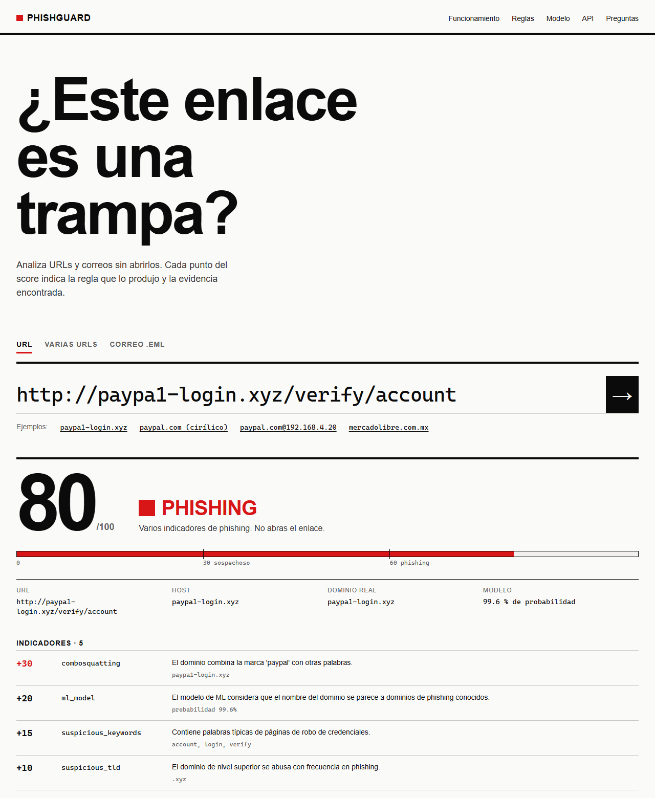
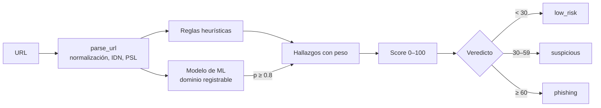

# PhishGuard

[](https://github.com/al4an444/phishguard/actions/workflows/ci.yml)


**Detector de phishing explicable para URLs y correos.** PhishGuard asigna un score de riesgo de 0 a 100
y explica *por qué*: cada punto del score corresponde a un indicador concreto (typosquatting, homógrafos
Unicode, marcas en subdominios, SPF/DKIM/DMARC fallidos, enlaces engañosos…).

- **Offline y seguro:** las URLs nunca se visitan. No hay peticiones de red ni se ejecuta contenido.
- **Explicable:** cada hallazgo incluye la regla, su peso, una explicación y la evidencia.
- **Reglas + ML:** heurísticas explicables reforzadas por un modelo entrenado con ~360.000 dominios reales.
- **Correos `.eml`:** autenticación del remitente, suplantación en el nombre, enlaces y adjuntos.
- **Tres interfaces:** CLI, API REST (FastAPI) e interfaz web.
- **Pensado para Latinoamérica:** detecta suplantación de bancos y servicios locales (BBVA, Santander,
  Banorte, Mercado Libre…) y palabras clave en español.



```
$ phishguard "http://paypa1-login.xyz/verify/account"
http://paypa1-login.xyz/verify/account
  Veredicto: PHISHING  (score 80/100)
  Dominio:   paypa1-login.xyz
   +30  combosquatting: El dominio combina la marca 'paypal' con otras palabras.  [paypa1-login.xyz]
   +20  ml_model: El modelo de ML considera que el nombre del dominio se parece a dominios de phishing conocidos.  [probabilidad 99.6%]
   +15  suspicious_keywords: Contiene palabras típicas de páginas de robo de credenciales.  [account, login, verify]
   +10  suspicious_tld: El dominio de nivel superior se abusa con frecuencia en phishing.  [.xyz]
   +5   no_https: La conexión no está cifrada (HTTP).
```

## Instalación

```bash
git clone https://github.com/al4an444/phishguard.git
cd phishguard
python -m venv .venv
source .venv/bin/activate        # Windows: .venv\Scripts\activate
pip install -e ".[api]"
```

## Uso

### CLI

```bash
phishguard https://ejemplo.com/login                 # una o varias URLs
phishguard -f urls.txt                               # una URL por línea (# para comentarios)
phishguard --json https://ejemplo.com                # salida JSON
phishguard --fail-on suspicious -f urls.txt          # exit code 1 si algo es sospechoso (útil en CI)
phishguard --email correo.eml                        # analizar un correo
```

Códigos de salida: `0` ok, `1` se alcanzó el umbral de `--fail-on`, `2` alguna URL no era válida.

### API REST e interfaz web

```bash
uvicorn phishguard.api:app --reload
```

- Interfaz web: <http://localhost:8000/> — analiza URLs, lotes de hasta 100 URLs y correos `.eml`.
  Los enlaces `/?url=<url codificada>` abren la página con el análisis ya hecho. La página no carga
  nada de terceros (ni fuentes, ni scripts, ni analítica).
- Documentación interactiva (Swagger): <http://localhost:8000/docs>

| Método | Ruta              | Descripción                           |
|--------|-------------------|---------------------------------------|
| GET    | `/health`         | Estado y versión                      |
| GET    | `/model`          | Metadatos y métricas del modelo de ML |
| POST   | `/analyze`        | `{"url": "..."}` → reporte            |
| POST   | `/analyze/batch`  | `{"urls": [...]}` (máx. 100) → lista  |
| POST   | `/analyze/email`  | `{"raw": "<correo .eml>"}` → reporte  |
| POST   | `/analyze/email/upload` | archivo `.eml` (multipart, máx. 5 MB) |

```bash
curl -X POST localhost:8000/analyze -H "Content-Type: application/json" \
     -d '{"url": "https://xn--pypal-4ve.com/signin"}'
```

### Docker

```bash
docker build -t phishguard .
docker run -p 8000:8000 phishguard
```

### Como librería

```python
from phishguard import analyze_url

report = analyze_url("https://rnicrosoft.com/login")
print(report.verdict, report.score)
for finding in report.findings:
    print(finding.rule, finding.weight, finding.evidence)
```

## Cómo funciona



1. **Parsing** (`features.py`): normaliza la URL, convierte dominios internacionales a/desde punycode,
   detecta IPs (incluidas formas ofuscadas como `3232235777` o `0xC0A80001`) y separa subdominio,
   dominio registrable y sufijo con la [Public Suffix List](https://publicsuffix.org/) (snapshot local).
2. **Reglas** (`rules.py`): cada regla es una función independiente que devuelve hallazgos.
3. **Modelo** (`ml.py`): puntúa el dominio registrable; solo aporta con alta confianza (ver [Modelo de ML](#modelo-de-ml)).
4. **Score** (`analyzer.py`): suma de pesos, con un máximo de 100.

### Reglas

| Regla | Peso | Detecta |
|---|---|---|
| `dangerous_scheme` | 60 | `javascript:`, `data:`, `vbscript:` |
| `homoglyph` | 40 | `paypa1.com`, `rnicrosoft.com`, letras cirílicas |
| `typosquatting` | 35 | `netfliix.com` (distancia de edición a una marca) |
| `mixed_scripts` | 30 | Dominio que mezcla alfabetos (latino + cirílico) |
| `brand_unofficial_domain` | 30 | `paypal.xyz` |
| `combosquatting` | 30 | `paypal-secure-login.com` |
| `ip_host` | 25 | `http://192.168.1.10/login` |
| `userinfo` | 25 | `http://paypal.com@evil.example/` |
| `brand_in_subdomain` | 25 | `paypal.com.account-check.example` |
| `risky_download` | 25 | Enlaces directos a `.exe`, `.apk`, `.scr`… |
| `punycode` | 15 | Dominio internacionalizado |
| `brand_in_domain` | 15 | `securepaypalhelp.com` |
| `suspicious_keywords` | 5–15 | `login`, `verify`, `cuenta`, `actualizar`… |
| `many_subdomains`, `suspicious_tld`, `url_shortener`, `free_hosting`, `non_standard_port`, `random_domain`, `embedded_redirect`, `brand_in_path`, `long_url` | 5–10 | Señales débiles que suman |
| `hyphenated_domain`, `no_https` | 5 | |

Las reglas de marca se desactivan en los dominios oficiales de cada marca (`brands.py`), y solo se
reporta el hallazgo de marca más fuerte para no inflar el score.

## Análisis de correos

```
$ phishguard --email data/emails/phishing_bbva.eml
Correo: Urgente: su cuenta ha sido suspendida
  De:        BBVA Mexico Seguridad <alertas@bbva-mx-seguridad.com>
  Veredicto: PHISHING  (score 100/100)
   +35  double_extension: Adjunto con doble extensión para ocultar un ejecutable.  [estado_de_cuenta.pdf.exe]
   +35  phishing_link: Contiene un enlace clasificado como phishing.
   +30  display_name_spoof: El nombre del remitente dice 'bbva' pero el correo viene de otro dominio.
   +30  deceptive_link: El texto de un enlace muestra un dominio pero apunta a otro.  [muestra bbva.mx, lleva a bbva-mx-seguridad.com]
   +25  dmarc_fail: La verificación DMARC falló: el remitente puede estar falsificado.
   ...
```

| Regla | Peso | Detecta |
|---|---|---|
| `phishing_link` / `suspicious_link` | 35 / 15 | Algún enlace del correo es phishing o sospechoso (cada enlace se analiza como URL) |
| `double_extension` | 35 | `factura.pdf.exe` |
| `display_name_spoof` | 30 | Nombre "PayPal" con un remitente que no es de PayPal |
| `deceptive_link` | 30 | El texto muestra `bbva.mx` pero el enlace va a otro dominio |
| `sender_*` | 15–40 | El dominio del remitente es un typosquat/homoglifo de una marca |
| `dmarc_fail`, `spf_fail`, `dkim_fail` | 25, 20, 15 | Autenticación fallida en `Authentication-Results` |
| `dangerous_attachment` | 25 | `.exe`, `.html`, `.iso`, `.lnk`, macros de Office… |
| `reply_to_mismatch`, `return_path_mismatch` | 15, 10 | Respuestas o rebotes hacia otro dominio |
| `urgency_language` | 5–15 | "urgente", "cuenta suspendida", "24 horas"… |
| `archive_attachment` | 10 | Adjuntos `.zip`, `.rar`, `.7z` |

## Modelo de ML

Además de las reglas, un modelo de **regresión logística** evalúa el dominio registrable
(`paypa1-login.xyz`) a partir de n-gramas de caracteres y rasgos como la entropía o la proporción de dígitos.

- **Datos:** ~200.000 dominios legítimos muestreados de todo el [Tranco top-1M](https://tranco-list.eu/)
  (no solo los más populares) y ~160.000 dominios de phishing de
  [Phishing.Database](https://github.com/Phishing-Database/Phishing.Database) (agrega PhishTank, OpenPhish
  y otras fuentes) y del feed de [OpenPhish](https://openphish.com/).
- **Limpieza:** se descartan los dominios de phishing que aparecen en Tranco (sitios legítimos comprometidos,
  no dominios del atacante), y se deduplica por dominio antes de separar train/test (80/20).
- **Seguro:** el modelo se guarda como JSON (252 KB), no como pickle, así que cargarlo no puede ejecutar
  código. La predicción es Python puro; scikit-learn solo se necesita para entrenar.

Métricas en el conjunto de test (dominios nunca vistos):

| Umbral | Precisión | Recall | Falsos positivos |
|---|---|---|---|
| 0.5 | 0.73 | 0.72 | 21 % |
| 0.8 | 0.93 | 0.40 | 2.3 % |
| 0.9 | 0.97 | 0.27 | 0.6 % |

ROC AUC: 0.84. Un modelo que solo ve el nombre del dominio tiene un techo claro, así que se integra de forma
**conservadora**: suma +10 con probabilidad ≥ 0.8 y +20 con ≥ 0.9, y **por sí solo nunca alcanza el umbral
de "sospechoso"**. Solo refuerza otras señales. No se aplica a IPs ni a dominios oficiales de marcas.
La probabilidad se incluye siempre en el reporte (`ml_probability`).

Para reentrenar con datos actualizados:

```bash
pip install -e ".[train]"
python scripts/train_model.py --refresh
```

## Evaluación

```bash
python scripts/evaluate.py data/sample.csv --show-errors
```

Sobre el dataset de muestra incluido (34 URLs, umbral 30):

| Exactitud | Precisión | Recall | F1 |
|---|---|---|---|
| 0.971 | 1.000 | 0.938 | 0.968 |

> El dataset de muestra es pequeño y está hecho a mano: sirve como prueba de regresión, no como
> benchmark. Para una evaluación real usa URLs de [PhishTank](https://phishtank.org/) u
> [OpenPhish](https://openphish.com/) y dominios legítimos de la [lista Tranco](https://tranco-list.eu/)
> en un CSV con columnas `url,label`.

## Limitaciones

- **Solo analiza la URL**, no el contenido de la página. Un phishing alojado en un dominio limpio y
  con una ruta genérica pasará desapercibido.
- **No sigue redirecciones:** los acortadores solo suman una señal débil.
- La lista de marcas es finita; marcas no incluidas no activan las reglas de suplantación.
- En correos, PhishGuard lee los resultados de SPF/DKIM/DMARC que dejó tu servidor de correo en
  `Authentication-Results`; no verifica las firmas por su cuenta.
- Un score bajo **no garantiza** que una URL o un correo sean seguros.

## Roadmap

- [x] Modelo de ML entrenado con features léxicas, combinado con las reglas
- [x] Análisis de correos (`.eml`): SPF/DKIM/DMARC, remitente, enlaces y adjuntos
- [ ] Modelo con features de la URL completa (requiere un dataset de URLs legítimas con rutas)
- [ ] Modo online opcional: edad del dominio (WHOIS/RDAP), certificado TLS, resolución de acortadores
- [ ] Integraciones opcionales: Google Safe Browsing, VirusTotal, URLhaus
- [ ] Lista de marcas configurable por archivo
- [ ] Extensión de navegador

## Desarrollo

```bash
pip install -e ".[dev,api]"
pytest
ruff check .
```

Estructura:

```
src/phishguard/
  features.py   parsing y normalización de URLs
  brands.py     marcas, dominios oficiales, homoglifos, Levenshtein
  rules.py      reglas de detección
  analyzer.py   score y veredicto
  ml.py         features y predicción del modelo (Python puro)
  model/        modelo entrenado (JSON)
  email_analyzer.py  análisis de correos .eml
  cli.py        interfaz de línea de comandos
  api.py        API REST (FastAPI)
  static/       interfaz web (HTML + CSS + JS sin dependencias ni build)
scripts/evaluate.py     métricas sobre un CSV etiquetado
scripts/train_model.py  descarga de datos y entrenamiento
data/emails/            correos de ejemplo
tests/                  pytest
```

¿Quieres contribuir? Lee [CONTRIBUTING.md](CONTRIBUTING.md).

## Licencia

[MIT](LICENSE)

## Autor

**Alan Ortega Álamo** · [al4an444.github.io](https://al4an444.github.io) · [GitHub](https://github.com/al4an444)
